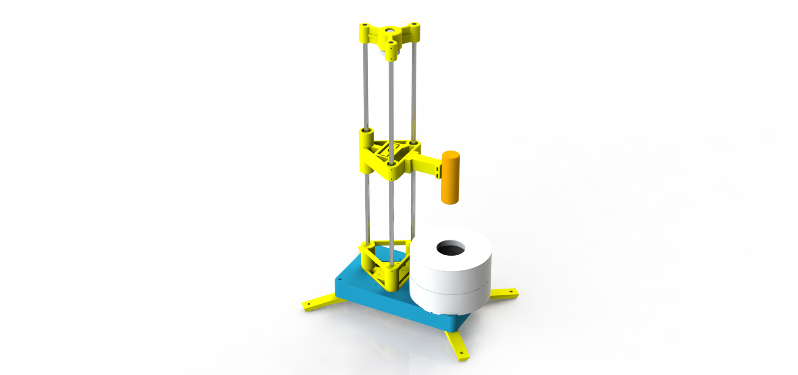

# MUFF: Motorized Positioner for Multi-Focus and Photometric Stereo Imaging

This repository contains the resources and documentation for the **MUFF** project, a low-cost motorized positioner designed to facilitate the acquisition of multi-focus and photometric stereo images of millimeter-scale objects. 

Developed primarily using **3D printing** and **Arduino**, MUFF automates the process of capturing images under varying focus planes and illumination conditions, enabling enhanced 3D object reconstruction.

## Features
- **Multi-Focus Stereo (MFS)**: Combines images at different focus levels into a single sharp composite image.
- **Photometric Stereo (PMS)**: Captures and analyzes surface details under varied lighting conditions to recover 3D shape information.
- **Automation**: Motorized positioning with sub-millimeter precision and up to 24 independent lighting conditions.
- **Affordable Design**: Built using 3D-printed components and readily available hardware.
- **Flexible Operation**: Controlled via an Arduino Nano microcontroller and a Python-based interface.

## Components
- **Hardware**: 
  - 3D-printed structural and mechanical parts.
  - Stepper motor and threaded rod for vertical displacement.
  - Adjustable light box with 24 LED sources.
- **Electronics**:
  - Arduino Nano for motion and lighting control.
  - DRV8825 motor driver and custom PCB for system integration.
- **Software**:
  - Arduino firmware for precise control of the positioner.
  - Python script for image acquisition and user interaction.

## Applications
MUFF is ideal for:
- Optical microscopy
- Imaging in fields like paleontology, petrology, manufacturing, and archaeology
- Low-power microscopy for small-scale object analysis

## Citation
If you use MUFF in your research or projects, please consider citing our work:

## Paper Link
[Paper](https://www.researchgate.net/publication/358866260_MUFF_A_Low-cost_Motorized_Positioner_Developed_by_Additive_Manufacturing_to_Obtain_Multi-focus_Images)

## Acknowledgments
This project was developed by **Gustavo Lelis da Silva**, **Jorge Stolfi**, and **Helena Cristina da Gama Leitão** in collaboration with UNICAMP and UFF, with funding from CNPq, FAPERJ, and FAPESP.

For detailed documentation and additional resources, visit the [official project page](http://www.ic.uff.br/~hcgl/Muff-index.html).

---

**Keywords**: Optical Microscopy, 3D Printing, Stereo Multifocus, Photometric Stereo, Arduino
